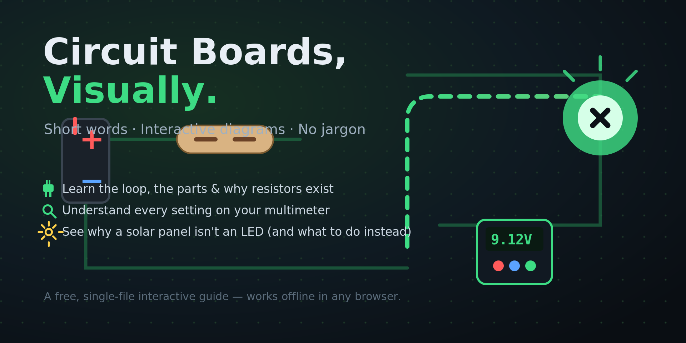

<p align="center">
  
</p>

<h3 align="center">⚡ Circuit Boards, Visually</h3>

<p align="center">
A free, single-file, interactive guide to circuit boards — built for people who struggle with long sentences and wall-of-text tutorials. Short words, big pictures, clickable switches, and a multimeter you can actually learn from.
</p>

<p align="center">
  <a href="#-try-it"><b>Live demo</b></a> ·
  <a href="#-whats-inside"><b>What's inside</b></a> ·
  <a href="#-run-it-locally"><b>Run locally</b></a> ·
  <a href="#-why"><b>Why this exists</b></a>
</p>

---

## 🔌 What this is

Pulled something apart and stared at the green board wondering what everything does? Same. This guide walks you from the absolute basics — a battery, a wire, an LED — all the way up to reading the symbols on a multimeter and figuring out whether you can plug a solar panel where an LED used to be.

No maths beyond one short formula. No paragraphs you have to re-read three times. Every idea is a diagram, and most of them **move when you click them**.

## 🧭 Try it

- **🌐 Live:** https://dlinacre.github.io/circuit-guide/
- **💻 Offline:** just open `index.html` in any browser. No internet, no install, no dependencies.

## 📦 What's inside

1. **The simplest loop** — battery → wire → LED → back, with a water-pump analogy.
2. **Flip the switch** — clickable demo showing how a switch breaks the loop.
3. **Why resistors exist** — drag a slider to 0 Ω and watch the LED pop; slide it up and it dims. Includes the one formula you'll ever need.
4. **Parts explorer** — click resistors, capacitors, diodes, transistors, chips, speakers, switches and solar panels to see what each does.
5. **What you see on a pulled-apart board** — traces, pads, components.
6. **Solar panel ↔ LED question** — visual answer to why they're not interchangeable, and what to do instead.
7. **The multimeter, in full** — a clickable dial showing what V⎓, V∿, A⎓, Ω, ))) , Hz and diode mode actually do, where the red lead goes, and what the screen will say. Plus the three jobs you'll really use (voltage, current, continuity beep) and a step-by-step for using it on your own radio and solar panel.
8. **Safety tips** — the few things that actually matter.

## 🛠 Tech

- One self-contained `index.html` — HTML, CSS and vanilla JavaScript only.
- Inline SVG for all diagrams (sharp at any zoom).
- Works offline. Total size is tiny.
- No build step, no framework, no tracker, no adverts.

## ▶ Run it locally

You don't *need* to — double-clicking `index.html` works. But if you want it served properly:

```bash
# Python 3
python3 -m http.server 8000
# then open http://localhost:8000
```

Or with Node:

```bash
npx serve .
```

## 🚀 Deploy to GitHub Pages

1. Create a new repo on GitHub (e.g. `circuit-guide`).
2. Push this folder to it:
   ```bash
   git init
   git add .
   git commit -m "Circuit Boards, Visually"
   git branch -M main
   git remote add origin https://github.com/DLinacre/circuit-guide.git
   git push -u origin main
   ```
3. On GitHub: **Settings → Pages → Source: `main` branch / root → Save**.
4. Wait a minute — your site is live at `https://YOUR-USERNAME.github.io/circuit-guide/`.

## ♿ Accessibility

- All interactive controls work with a mouse or touch.
- Dark high-contrast theme used throughout.
- Short sentences and plain words by design (written for readers who find long text hard).
- Diagrams have `aria-label`s.

## 🤝 Contributing

Spotted a typo, a confusing bit, or want to add a part? Open an issue or a PR. Keep the rule: **if it needs a paragraph, draw it instead.**

## 📄 License

MIT — use it, fork it, translate it, share it.

---

<p align="center">
Made for tinkerers who learn with their eyes. 🔧
</p>
